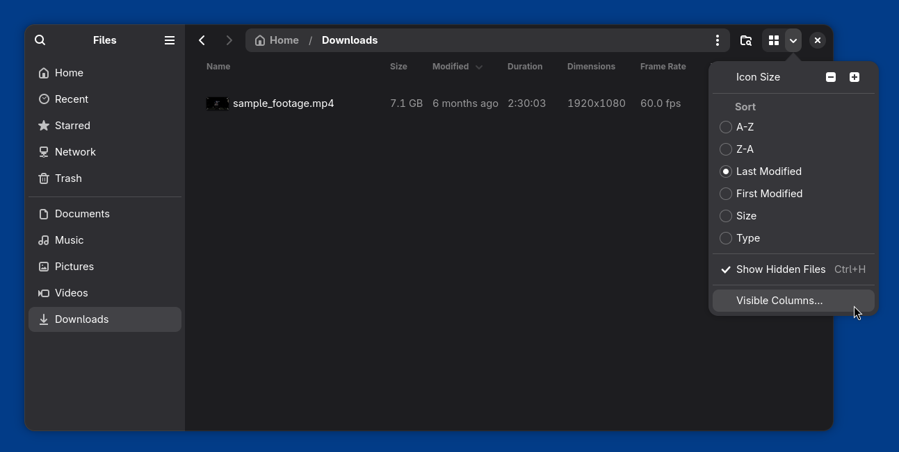
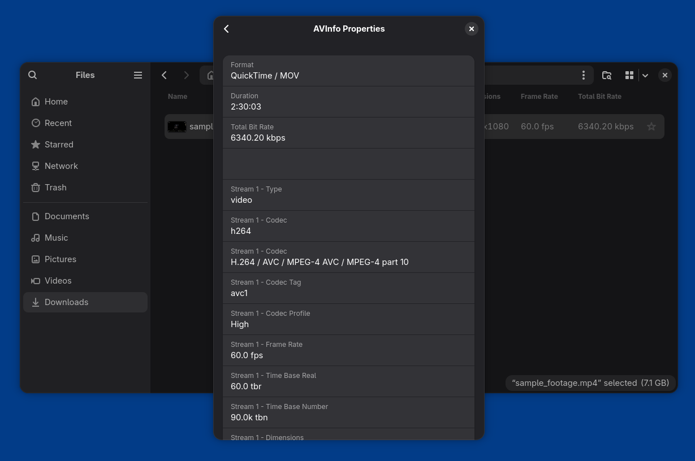

# Usage

After installing the extension, audio and video information for media files can be previewed in the _List View_. The media info columns can be activated by navigating to _View Options -> Visible Columns_ and activating the columns for viewing stream information.

In addition, audio and video stream info can viewed in the _Properties_ tab under _AVInfo Properties_.

